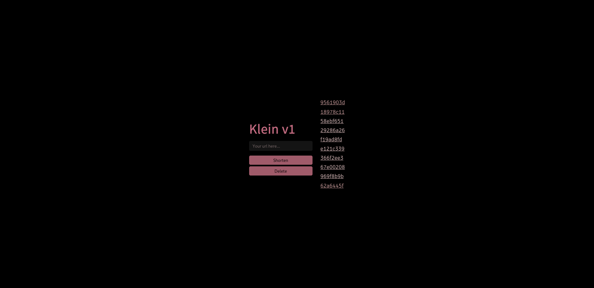

[![Contributors][contributors-shield]][contributors-url]
[![Forks][forks-shield]][forks-url]
[![Stargazers][stars-shield]][stars-url]
[![Issues][issues-shield]][issues-url]
[![GPL3 License][license-shield]][license-url]

 

  <h3 align="center">Klein</h3>

  

    Blazing fast URL shortener made with simplicity in mind
     
    <a href="https://github.com/pinkcig/klein/issues">Report Bug</a>
    ·
    <a href="https://github.com/pinkcig/klein/issues">Request Feature</a>
  

<!-- TABLE OF CONTENTS -->

  
<h2 style="display: inline-block">Table of Contents</h2>

  <ol>
    <li>
      <a href="#about-the-project">About The Project</a>
      <ul>
        <li><a href="#built-with">Built With</a></li>
      </ul>
    </li>
    <li>
      <a href="#getting-started">Getting Started</a>
      <ul>
        <li><a href="#prerequisites">Prerequisites</a></li>
      </ul>
    </li>
    <li><a href="#roadmap">Roadmap</a></li>
    <li><a href="#contributing">Contributing</a></li>
    <li><a href="#license">License</a></li>
    <li><a href="#acknowledgements">Acknowledgements</a></li>
  </ol>

## About The Project

**Klein is a blazing fast URL shortener made with simplicity in mind.**

### Built With

* Go
* MongoDB
* Redis
* Handlebars

## Getting Started

To get a local copy up and running follow these simple steps.

* Docker
    * `git clone https://github.com/pinkcig/klein.git`
    * `cd klein`
    * `# docker build -t klein:latest .`
    * `# docker run -dp 8080:8080 klein:latest`
* From Scratch
    * `git clone https://github.com/pinkcig/klein.git`
    * `cd klein`
    * `go install`
    * `make`

### Prerequisites

* Go (required)
* Mongo (required)
* Redis (required)
* Git (optional)
* GNU Make (optional)

## Roadmap
See the [open issues](https://github.com/pinkcig/klein/issues) for a list of proposed features (and known issues).

## Contributing
Contributions are what make the open source community such an amazing place to be learn, inspire, and create. Any contributions you make are **greatly appreciated**.

1. Fork the Project
2. Create your Feature Branch (`git checkout -b feature/AmazingFeature`)
3. Commit your Changes (`git commit -m 'Add some AmazingFeature'`)
4. Push to the Branch (`git push origin feature/AmazingFeature`)
5. Open a Pull Request

## License
Distributed under the GPL3 License. See `LICENSE` for more information.

## Acknowledgements

* [pinkcig](https://github.com/pinkcig)
* [SerenModz21](https://github.com/SerenModz21)
* [Maybe you? ;)](https://github.com/pinkcig/klein/issues)

[contributors-shield]: https://img.shields.io/github/contributors/pinkcig/repo.svg?style=for-the-badge
[contributors-url]: https://github.com/pinkcig/klein/graphs/contributors
[forks-shield]: https://img.shields.io/github/forks/pinkcig/repo.svg?style=for-the-badge
[forks-url]: https://github.com/pinkcig/klein/network/members
[stars-shield]: https://img.shields.io/github/stars/pinkcig/repo.svg?style=for-the-badge
[stars-url]: https://github.com/pinkcig/klein/stargazers
[issues-shield]: https://img.shields.io/github/issues/pinkcig/repo.svg?style=for-the-badge
[issues-url]: https://github.com/pinkcig/klein/issues
[license-shield]: https://img.shields.io/github/license/pinkcig/repo.svg?style=for-the-badge
[license-url]: https://github.com/pinkcig/klein/blob/master/LICENSE.txt
[linkedin-shield]: https://img.shields.io/badge/-LinkedIn-black.svg?style=for-the-badge&logo=linkedin&colorB=555
